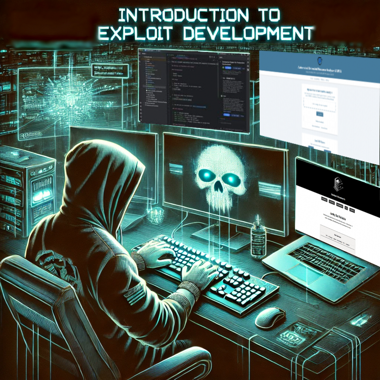

# THIS COURSE IS NOT READY FOR PRODUCTION

[//]: # (<p align="center">)

[//]: # (    )

[//]: # (</p>)

**Shameless plug**

This course is given to you for free by The Perkins Cybersecurity Educational
Fund: [https://perkinsfund.org/](https://perkinsfund.org/) in collaboration with the Malcore
team: [https://m4lc.io/courses/register](https://m4lc.io/courses/register)

Please consider donating to [The Perkins Cybersecurity Educational](https://donorbox.org/malware-bible-fund) Fund and
registering for Malcore. You can also join the Malcore Discord server
here: [https://m4lc.io/courses/discord](https://m4lc.io/courses/discord)

Malcore offers free threat intel in our Discord via their custom designed Discord bot. Join the Discord to discuss this
course in further detail or to ask questions.

You can also support The Perkins Cybersecurity Educational Fund by buying them a coffee

[](https://ko-fi.com/perkinsfund)

#### Sponsor

This course is sponsored by [Backyard Bandwidth](https://backyardbandwidth.com/)!

<p align="center">
    
</p>

Enterprise-grade performance at a price that makes sense. No hidden fees, no catch—just reliable, affordable services with a commitment to privacy. Janky But Reliable.

---

### NOTE: 
This course assumes that you understand the basics of asm, shellcode, python, and C code. You can find the relevant courses here:**

- [ASM](Introduction%20to%20x86%20Assembly.md)
- [Shellcode](Introduction%20to%20Shellcode.md)
- [C](Introduction%20to%20C.md)
- [Python](Introduction%20to%20Python.md)

---

# What will be covered?

- [What is exploit development?](#what-is-exploit-dev)
- [Tools of the Trade](#tools-of-the-trade)
- [Return oriented programming](#return-oriented-programming-rop)
- [Heap exploitation](#heap-exploitation)
- [Modern exploit techniques](#modern-exploit-techniques)
- [Kernel Exploits](#kernel-exploits)
- [That's all folks](#thats-all-folks)

---

# What is exploit dev?

Exploit developmeent is the process of identifying, understanding and writing code to take advantage of software
vulnerabilities. This allows the developer to execute unintended behavior on the target. In simple terms: exploit
developement is turning software bugs into weapons.

You can see a simple breakdown of the process below:

- Find vulnerabilities
    - Identify an issue or weakness in software. Memory corruption, use after free, integer overflow, buffer overflow,
      etc
- Understand how the bug can be exploited
    - Once you have found the bug you can determine how to control the execution of the bug. Can you overwrite a return?
      Can you inject shellcode into the process? Can you force it to leak information?
- Writing and testing the exploit
    - Your goal is to develop reliable repeatable code with as high a success rate as possible. This often involves
      debugging with tools such as IDA. You can find the cheatsheet [here](../The%20Scriptures/idapro.md).
- Bypassing security protections
    - Modern systems have security features such as address space layout randomization (ASLR), data execution
      prevention (DEP), and stack canaries (detects and stops stack overflows). These will not be covered in depth in
      this course.

---

# Tools of the Trade

#### Debuggers

| **Tool**   | **Description**                                                                                                                             |
|------------|---------------------------------------------------------------------------------------------------------------------------------------------|
| `GDB`      | The **GNU Debugger**, used for debugging binaries on Linux. Essential for analyzing crashes and reverse engineering memory corruption bugs. |
| `GDB-PEDA` | An enhanced GDB with **exploit development tools** built-in, making it easier to analyze memory and registers.                              |
| `GEF`      | Another powerful GDB plugin, lightweight and packed with **heap analysis and ROP tools**.                                                   |
| `WinDbg`   | The **Windows Debugger**, used for analyzing Windows binaries and kernel debugging.                                                         |
| `LLDB`     | Apple's **alternative to GDB**, useful for debugging on macOS.                                                                              |

#### Binary Analysis Tools

| **Tool**   | **Description**                                                                                                          |
|------------|--------------------------------------------------------------------------------------------------------------------------|
| `IDA Pro`  | The **industry standard** for reverse engineering. It provides a graphical disassembler and decompiler.                  |
| `Ghidra`   | An **open-source** alternative to IDA Pro, developed by the NSA. Useful for **static analysis and reverse engineering**. |
| `radare2`  | A lightweight **disassembler and debugger**, packed with scripting capabilities.                                         |
| `Binwalk`  | Extracts and analyzes **firmware and binary blobs** to find embedded code and vulnerabilities.                           |
| `Checksec` | Displays the **security protections** enabled in a binary (e.g., ASLR, NX, RELRO).                                       |

#### Exploitation Frameworks

| **Tool**     | **Description**                                                                                              |
|--------------|--------------------------------------------------------------------------------------------------------------|
| `Pwntools`   | A powerful **Python library for exploit development**, useful for building payloads and automating exploits. |
| `ROPgadget`  | Finds **useful ROP gadgets** in a binary for Return-Oriented Programming (ROP) exploits.                     |
| `OneGadget`  | Identifies **one-shot RCE gadgets** in binaries with `libc`.                                                 |
| `angr`       | A **binary analysis framework** that can symbolically execute programs to find exploitable conditions.       |
| `Metasploit` | A penetration testing framework that includes **prebuilt exploits** for various vulnerabilities.             |

#### Shellcode Generation

| **Tool**   | **Description**                                                                |
|------------|--------------------------------------------------------------------------------|
| `MSFVenom` | Generates **custom shellcode payloads** for various architectures.             |
| `nasm`     | Assembler used for writing custom **x86 and x86_64 shellcode**.                |
| `objdump`  | Disassembles binaries and **extracts shellcode** from compiled programs.       |
| `strace`   | Traces **system calls** made by a binary to identify possible vulnerabilities. |

#### Fuzzing

| **Tool**    | **Description**                                                        |
|-------------|------------------------------------------------------------------------|
| `AFL++`     | A fast **fuzzing tool** that automatically finds crashes and exploits. |
| `Honggfuzz` | A modern fuzzer with **built-in sanitizer integration**.               |
| `Radamsa`   | A **mutation-based fuzzer** that generates random test cases.          |
| `zzuf`      | Corrupts input to test how a program reacts to unexpected data.        |

#### Networking & Exploit Testing

| **Tool**     | **Description**                                                        |
|--------------|------------------------------------------------------------------------|
| `Wireshark`  | Captures and analyzes **network traffic** to inspect exploit behavior. |
| `Tcpdump`    | A command-line alternative to Wireshark for **packet analysis**.       |
| `Netcat`     | A simple tool for **sending and receiving data** over TCP/UDP.         |
| `Burp Suite` | A web security tool for testing **web-based exploits and injections**. |

#### Virtual Machines & Sandboxes

| **Tool**     | **Description**                                                               |
|--------------|-------------------------------------------------------------------------------|
| `Malcore`    | Online reverse engineering [platform](https://app.malcore.io/register)        |
| `QEMU`       | Lightweight emulator for testing **kernel and system-level exploits**.        |
| `VMware`     | Used for running **Windows and Linux** virtual machines for testing exploits. |
| `VirtualBox` | A free alternative to VMware for **sandboxed environments**.                  |
| `Docker`     | Runs isolated containers, useful for **quick testing environments**.          |

---

# Buffer overflows

A buffer overflow occurs when software writes more data into a buffer than it is able to hold, this leads to a memory
corruption. This allows an attacker to overwrite memory and can potentially lead to code execution. As na example lets
take the following C code:

```c
#include <stdio.h>
#include <string.h>

void vulnerable_function(char *input) {
    char buffer[16];
    strcpy(buffer, input);
    printf("You entered: %s\n", buffer);
}

int main(int argc, char *argv[]) {
    if (argc < 2) {
        printf("Usage: %s <input>\n", argv[0]);
        return 1;
    }
    vulnerable_function(argv[1]);
    return 0;
}
```

What this program does:

- `strcpy` blindly copies input into the `buffer` variable
- If the input is longer than the establihed size (16 bytes) it overwrites adjacent memory
- This can allow us to overwrite the functions return address allowing us to control execution

To trigger the overflow all we would need to do is send more data to the buffer than it is expecting. In order to
trigger the overflow we will need to compile this program without any protections, we can do so like this:

```shell
salty@Loki:/mnt/c/Users/saman/PycharmProjects/Malcore-Free-Courses$ gcc -fno-stack-protector -z execstack -Wall .github/exploit_dev_files/example_c.c -o .github/exploit_dev_files/example_c
salty@Loki:/mnt/c/Users/saman/PycharmProjects/Malcore-Free-Courses$ .github/exploit_dev_files/example_c
Usage: .github/exploit_dev_files/example_c <input>
salty@Loki:/mnt/c/Users/saman/PycharmProjects/Malcore-Free-Courses$ .github/exploit_dev_files/example_c AAAAAAAAAAAAAAAAAAAAAAAAAAAAAAAAAAAAAAAAAAAAAAAAAAAAAAAAAAAAAAAAAAAAAAAAAAAAAAAAAAAAAA
You entered: AAAAAAAAAAAAAAAAAAAAAAAAAAAAAAAAAAAAAAAAAAAAAAAAAAAAAAAAAAAAAAAAAAAAAAAAAAAAAAAAAAAAAA
Segmentation fault
salty@Loki:/mnt/c/Users/saman/PycharmProjects/Malcore-Free-Courses$
```

As you can see above we get a seg fault, what this means is that the program attempted to access memory that it is not
allowed to. To prevent buffer overflows the easiest way is to compile the code with protections as well as use safe
functions like `strncpy` over `strcpy`. A comprehensive list of compiler commands in `gcc` is as follows:

| **Flag**                   | **Purpose**                                                                                            |
|----------------------------|--------------------------------------------------------------------------------------------------------|
| `-fstack-protector`        | Adds stack canaries.                                                                                   |
| `-fstack-protector-all`    | Adds stack protection to **all** functions.                                                            |
| `-fstack-clash-protection` | Detects allocations that could overwrite adjacent memory.                                              |
| `-D_FORTIFY_SOURCE=2`      | Enhances functions like `strcpy()`, `memcpy()`, and `sprintf()` to detect buffer overflows at runtime. |
| `-Wstack-protector`        | Enables warnings if stack protection is ineffective.                                                   |
| `-Wl,-z,relro`             | Marks ELF sections as **read-only** after initialization, preventing memory corruption.                |
| `-Wl,-z,now`               | Forces immediate symbol resolution, reducing attack surfaces like **lazy binding exploits**.           |
| `-Wl,-z,noexecstack`       | Marks the stack as non-executable, preventing shellcode execution.                                     |
| `-Wl,-z,nodlopen`          | Disables dynamic library loading, reducing exploit vectors.                                            |
| `-fsanitize=address`       | Enables **AddressSanitizer (ASan)** to detect buffer overflows, use-after-free, and memory leaks.      |
| `-fsanitize=undefined`     | Enables **Undefined Behavior Sanitizer (UBSan)** to detect out-of-bounds memory access.                |
| `-fsanitize=leak`          | Enables **LeakSanitizer** to detect memory leaks.                                                      |
| `-fsanitize=bounds`        | Detects **out-of-bounds array accesses**.                                                              |
| `-fsanitize=thread`        | Detects **race conditions** in multi-threaded programs.                                                |
| `-g`                       | Adds debug symbols for **better debugging** in tools like `gdb`.                                       |
| `-ggdb`                    | Provides more detailed debugging info for `gdb`.                                                       |

_NOTE_: There are probably more that will protect you these are just what we could think of at the time

---

# Return oriented programming (ROP)

Return oriented programming (ROP) is an advanced exploitation technique that is used to execute arbitary code in a
program that has security measures such as non-executable stack (NX/DEP). This method allows bypassing of traditional
buffer overflow protections by reusing prexisting code called gadgets instead of injecting new shellcode. ROP is needed
because modern operating systems enforce NX stacks (non-executable) meaning even if you overflow the buffer and write
shellcode into the memory it cannot be executed. By using ROP you can bypass this protection using gadgets that already
exist within the executable parts of the program.

#### Core ROP idea

1. Overwrite return addresses on the stack with the address of a useful instruction sequence
2. Each gadget must end with a `ret` instruction allowing chaining of multiple
3. Control flow is hijacked to perform arbituary operations

#### ROP gadgets

A ROP gadget is a small sequence of instructions ending with a `ret` instruction. By chaining these together to form a "
ROP chain" you can perform complex tasks. As an example in a binary file you might have:

```nasm
pop eax
ret
```

This gadget will pop a value from the stack into `eax` and returns the address. Another example would be:

```nasm
mov dword prt [ecx], eax
ret
```

This gadget writes the value in `eax` to the memory address stored in `ecx`. By choosing the correct gadgets you can
construct an entire programs execution flow using preexisting code.

#### Building a ROP chain

To build a ROP chain we will create a vulnerable program that you can
download [here](../.github/exploit_dev_files/rop_chain_c.c), you can also see information about this program on
Malcore [here](https://app.malcore.io/share/637b72e6d2815d7e836350da/67cf165328b1422d47e356a2).

```c
#include <stdio.h>
#include <string.h>

void win() {
    printf("You've won! Code execution achieved.\n");
}

void vulnerable_function() {
    char buffer[64];
    gets(buffer);
}

int main() {
    vulnerable_function();
    return 0;
}
```

This functions `gets(buffer)` call allows us to overflow the stack and overwrite return addresses. Now we can build the
theoretical ROP chain.

Assuming the `win()` function is at location `0x080484b6` instead of injecting shellcode we want to overwrite the return
address with the `win()` function address. Assuming we want to execute `/bin/sh` using gadgets in `libc` we need to do
the following:

- Find a gadget to setup the `execve` system call
- Find a gadget ot control the registers
- Find the return address to `libc`'s `system()` function

_NOTE_: It is worth noting that in more complex situations you may not have direct access to useful functions like this.

We can do this using theoretical gadgets like this:

```nasm
pop eax
ret         ;; load syscall

pop ebx
ret         ;; load address of /bin/sh

pop ecx
ret         ;; null pointer for argv

pop edx
ret         ;; null pointer for envp

int 0x80    ;; trigger execve("/bin/sh", NULL, NULL)
```

The full payload for the exploit might look something like this:

```shell
padding + gadget1 + "/bin/sh" + address + gadget2 + NULL + gadget3 + syscall
```

While a visual representation of this looks like the following:

```
# Stack before the exploit is crafted
-----------------------------------
|  Return Address (main)          |
|---------------------------------|
|  Saved EBP                      |
|---------------------------------|
|  Buffer (64 bytes)              |
|---------------------------------|
|  Overflow Starts Here           |
-----------------------------------

# Stack after the exploit is crafted
-----------------------------------
|  Address of ROP Gadget 1        | 
|---------------------------------|
|  Argument for Gadget 1          |
|---------------------------------|
|  Address of ROP Gadget 2        |
|---------------------------------|
|  Argument for Gadget 2          |
|---------------------------------|
|  Address of "system"            | 
|---------------------------------|
|  Address of "/bin/sh"           | 
-----------------------------------
```

The stack "unwinds" through `ret` instructions executing each gadget in sequence.

#### Defending against ROP

Modern systems have defenses to prevent ROP such as:

1. ASLR (address space layout randomization): randomizes the memory addresses to prevent finding gadgets
2. Stack canaries: detect stack overflows
3. CFI (control flow integrity): ensures valid execution flow
4. CET/Shadow Stacks: or ROP mitigation techniques to block ROP by tracking return addresses

#### TL;DR

ROP chaining allows attacker to bypass DEP/NX by chaining already preexisting instruction sequences to exploit and
manipulate stack behavior. There are plenty of ways to prevent ROP from happening by just being a decent developer.

---

# Heap exploitation

Heap exploitation is a class of attacks that targets vulerabilities in dynamic memory managment. You can exploit
weaknesses in a memory allocators such as `malloc`, `free`, `new`, `delete` in C and C++. Heaps are different from
stacks which which is used for function management. Common heap exploitation techniques:

- Heap overflow
- Use-After-Free
- Double free

#### Heap Spraying

Before we can get into these common techniques we should touch on heap spraying. Heap spraying is a technique where you
allocate a large number of predictable objects in memory, this allows you to increase the likelihood of placing your
shellcode at a desired location. For example it is used in browser exploits a lot to overwrite memory in engines:

```javascript
var shellcode = unescape("%u4141%u4141%u4141%u4141");
var spray = [];
for (var i = 0; i < 10000; i++) {
    spray[i] = shellcode;
}
```

The above code fills the heap with the spray buffers by allocating a large number of identical heap objects. This
predictably places the shellcode within memory.

#### Heap overflows

A heap overflow occurs when a program writes more data into a heap-allocated buffer than its allocated size. This leads
to memory corruption. You can find a downloadable example [here](../.github/exploit_dev_files/heap_overflow) and view
information about it on Malcore [here](https://app.malcore.io/share/637b72e6d2815d7e836350da/67cf1b3682a4a19ffb78fdb1).

```c
#include <stdio.h>
#include <stdlib.h>
#include <string.h>

int main() {
    char *buffer = (char *)malloc(16);
    strcpy(buffer, "AAAAAAAAAAAAAAAAAAAAAAAAAAAA"); 
    printf("Buffer: %s\n", buffer);
    free(buffer);
}
```

Here, the `buffer` variable is allocated to 16 bytes. As you can see we overwrite it with more data. This can overwrite
adjacent heap metadata and potentially allow an attack to control execution flow. In order to visualize this information
please see the following graphs:

```
# before overflow
Heap Memory:
[ BUFFER ][ METADATA ][ NEXT CHUNK ]

# after overflow
Heap Memory:
[ BUFFER OVERFLOWED ][ METADATA CORRUPTED ][ ATTACKER CONTROLLED CHUNK ]
```

Assuming this overwritten memory includes function pointers or metadata used by the allocator, we can manipulate them to
gain code execution.

#### Use-After-Free

A UAF (use after free) occurs when a program continues to use memory after it has been freed. This allows us to exploit
dangling pointers. You can find a downloadable code example [here](../.github/exploit_dev_files/use_after_free) and see
information on the file on
Malcore [here](https://app.malcore.io/share/637b72e6d2815d7e836350da/67cf1c6782a4a19ffb78ff89).

```c
#include <stdio.h>
#include <stdlib.h>
#include <string.h>

int main() {
    char *buffer = malloc(16);
    free(buffer); 
    strcpy(buffer, "Exploited!"); 
    printf("%s\n", buffer);
}
```

This program uses memory after we have freed it as you can see. This can lead to exploitation by reallocating it to
malicious data. To visualize a UAF please see the following:

```
# Before free
Heap Memory:
[ BUFFER (0x1234) ][ METADATA ]

# After free
Heap Memory:
[ FREE SPACE ][ METADATA ]

# Exploitation
Heap Memory:
[ MALICIOUS DATA (0x1234) ][ METADATA ]
```

In the above visualization, we reallocated the freed chunk with our own malicious data and hijacked the control.

#### Double free

Double free's happen when the same memory is freed twice. This can lead to heap corruption. You can download a copy of
the double free vulnerable code [here](../.github/exploit_dev_files/double_free) and see information on
Malcore [here](https://app.malcore.io/share/637b72e6d2815d7e836350da/67cf1dad4c61526edf9b6f15).

```c
#include <stdio.h>
#include <stdlib.h>

int main() {
    char *buffer = malloc(16);
    free(buffer);
    free(buffer); 
}
```

As you can see in the above code `free` is called twice on the same buffer. This can lead to a corruption of the "
freelist". We can manipulate the heap allocator into reusing the corrupted memory, this may lead to arbitary write or
the ability to hijack function pointers. A visualization of a double free can be seen below:

```
# Normal free
Heap Memory:
[ BUFFER FREED ][ METADATA ]

# Double free
Heap Memory:
[ CORRUPTED FREELIST ][ METADATA ]
```

#### Defense against heap exploitation

- Canaries or Heap Cookies: random values placed before chunks to detect corruption
- ASLR (address space layout randomization): randomizes heap locations to prevent predictable exploits
- DEP (data execution prevention): prevents the execution of heap memory
- tcache and hardened allocators: modern allocators like `tcmalloc` and `jemalloc` introduce security mechanisms.

---

# Modern Exploit Techniques

Exploitation is an ever evolving field that is constantly growing while attackers find new and more creative exploit
techniques. While buffer overflows and ROP remains as the foundation of exploitation, modern exploits are more
sophisticated and require more to gain control. This section will cover advanced exploitation practices and topics that
are beyond the traditional memory corruptions.

#### Format String Vulnerabilities

Format string exploits are a powerful underrated technique that can provide informational leaks, arbituary memory
writes, and even code exection. C functions like `printf`, `fprintf`, and `snprintf` allow developers to use string
format specifiers to display certain data types such as: `%s`, `%d%`, `%p`. If a developer forgets to provide the proper
format specifier the string can be manipulated. This vulnerable code can be
downloaded [here](../.github/exploit_dev_files/string_vuln) and you can also see the Malcore
analysis [here](https://app.malcore.io/share/637b72e6d2815d7e836350da/67cf347e28b1422d47e37313).

```c
#include <stdio.h>
void vulnerable_function(char *user_input) {
    printf(user_input);
}
int main(int argc, char *argv[]) {
    vulnerable_function(argv[1]);
    return 0;
}
```

The above code can allow us to get information disclosure as well as possibly even arbituary reads. Exploiting this is
fairly simple and can be done like so:

```shell
(.venv) salty@Loki:/mnt/c/Users/saman/PycharmProjects/Malcore-Free-Courses$ .github/exploit_dev_files/string_vuln %p
0x7fffffffdc38  # we now have the stack value
```

By combing the leaks and arbituary writes it is entirely possible to get a full takeover of this program.

##### Mitigating this attack

- Always user `printf("%s", variable);` to explicitly specify a format.
- Enable `FORTIFY_SOURCE`, `ASLR`, and `Stack Canaries`.

#### Arbituary Read/Write Primitives

Exploiting is not always about getting direct code execution. Sometimes you need some help a long the way or places to
walk like "stepping stones". An arbituary read lets an attacker read a memory location, this is often used to leak ASLR
protected addresses. An arbituary write allows modifying memory which can lead to overwriting function pointers, hijack
control flow, or privelege escalation. Take the following pseudo code:

```c
struct user {
    char name[16];
    int admin;
};

void edit_user(struct user *u) {
    printf("Enter new name: ");
    gets(u->name);
}

```

Using a buffer overflow on the `gets()` call we are able to overwrite the username to `admin = 1` and possibly get
unauthorized permission granted to us.

# Kernel Exploits

Userland is fun but what happens when we need to dive a little deeper? You get to kernel exploits! Breaking into the
kernel would mean that you officially own that system. In a nutshell the kernel controls everything including: memory,
processes, and hardware. Exploiting the kernel means bypassing `Ring 0` protections and executing code with `root`
priveleges.

#### Common Kernel Exploits

- NULL pointer dereference: if the kernel dereferences a NULL pointer, attackers are able to map user memory at `0x0`
  and trick it into executing code
- Race conditions: this is a bug where multiple processes access shared memory in an unsafe way leading to pivelege
  escalation
- Use-After-Free (UAF): reallocating freed kernel objects with malcious data

Below is a simple example of a UAF:

```c
int fd = open("/dev/path/to/something", O_RDWR);

// free the object
ioctl(fd, FREE_OBJECT, NULL);

// using after it has been freed - possible to hijack
ioctl(fd, USE_OBJECT, NULL);
```

By performing heap spraying techniques it is possible for attackers to replace freed objects with controlled data and
hijack the execution.

#### Mitigations

- KASLR (Kernel Address Space Layout Randomization): randomizes the kernel memory locations.
- SMEP (Supervisor Mode Execution Prevention): prevents execution of userland code within the kernel.
- Memory tagging: detects UAF and buffer overflows dynamically

---

# That's all folks

Thank you for reading and making it through this introduction course! We have covered a lot of information in a short time with everhting from fundamental memory corruption to advanced ROP techniques. Undersatnding these is crucial not only for offesnive security but for defesnive as well, as it helps to build more secure software. As you have seen this is both an art and a science and requires creativity, patience, and a deep understanding of system internals. We hope that you have gotten as much out of this course as we have gotten from writing it.

Once again this course is given to you for free by the Perkins Cyber Security Educational Fund in collaboration with Malcore! If you found this information valuable or want to help support the creation of the Malware Bible please consider one of the following:
- Donating to the Malware Bible Fund [here](https://donorbox.org/malware-bible-fund)
- Registering for Malcore [here](https://m4lc.io/courses/register)
- Joining the Malcore Discord [here](https://m4lc.io/courses/discord)
- Or looking into our wonderful sponsor [Backyard Bandwidth](https://backyardbandwidth.com/) for all your technical needs!
