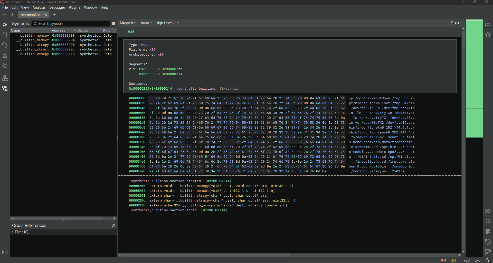

# Introduction to Reverse Engineering

<div align="center">


</div>

**Shameless plug**

This course is given to you for free by The Perkins Cybersecurity Educational Fund: [https://perkinsfund.org/](https://perkinsfund.org/)

Please consider donating to [The Perkins Cybersecurity Educational](https://donorbox.org/malware-bible-fund) Fund 

You can also support The Perkins Cybersecurity Educational Fund by buying them a coffee

[](https://ko-fi.com/perkinsfund)**

##### NOTE: This course assumes that you know the PE file format, and know how to use Ghidra

# What will be covered?

- [What are we reversing](#what-are-we-reversing)
- [Getting started](#getting-started)
  - [Needed tools](#the-tools-you-will-need)
  - [First steps](#your-first-steps)
  - [The files](#the-files)
    - [monitor](#monitor)

# What are we reversing?

This course will take you through the process of reverse engineering the internals of a heart monitor. This heart monitor is the Contect-CMS8000. We decided to use the heart monitor because there has never been a course for introduction to reverse engineering on analyzing the firmware of a heart monitor. You can find all the files needed to reverse engineer this here: [https://github.com/Perkins-Fund/Introduction-to-RE](https://github.com/Perkins-Fund/Introduction-to-RE)

We will not be extracting the firmware and reversing the hardware, our focus will be on the internals after extraction. After you have cloned the above repository you will have the following files with the following hashes:

```
82f86a1a7d52e5d0506d3967aa9a5ef06a7e9bfdca5511a217dec62667820e9e  ./bin/000000r_.ratr
2fa8172208b9c59226454fbaddac468174572f4a2b9926dcd7f607cd86de5fa7  ./bin/cmddog
12869c50efe637f2b137c6cb53f9d7ff23b755710812ba78ac748207bf566c2b  ./bin/data/bm_demo_data
ced3f1abe9fae2a01ccd8c1925bfc57ad0891a189fd0bb265d4c6f6b3e12ac10  ./bin/data/co21
4eb4d16f9ec39f339810d3888df428a8333502f5be773ee4b7c167f3f31bf308  ./bin/data/codemo
cd7ef3ccd969fcd9d7c4c5b4d00339cb52a2b89e6bc4875afb552aba580c999d  ./bin/data/ecgdata
c510954d6b93fa64d4e7d7c465b28cde4b102864295a334b94cfd37a349313a2  ./bin/data/ecgdataarr
a91a929c6fb0cbbb5afc0d9e4ac369b144af4fa45aca0ca24cdc92b77e30ed4f  ./bin/data/lang/bulgarian
ad421eecd8fd8f55a4f1b3175a16c583e85261000ee1ffe31cadcc022c6156b5  ./bin/data/lang/chinese
d8bc062929e0fd527df5c9b69d04e7092c3a85e927a9a81f30b3afcdbf928a04  ./bin/data/lang/Czech
9ed9561c4426743bd15aadd2ad229208cc02b68ff861a9fb27fd908f9c5ead33  ./bin/data/lang/Dutch.lan
58f39915075f606573dad64046521e2602a84b5b6187a291ee6014fb0f01757c  ./bin/data/lang/english
b25b6c6a10b5186cd1e94b0b711a18d5e41afc4ce259f72289fe80a53586e690  ./bin/data/lang/french
b8c14f50cac5c32e02641a658f65f6f2345c2349caf511f1b8c29329f23298ba  ./bin/data/lang/German
f1e176e29815403f833ece39fff8e3f154a06626c8b1b46f51815508b0767d27  ./bin/data/lang/Italian
906aafd48a389b08858dba7eec047143df126a157c344ce3e31533ea27a7649e  ./bin/data/lang/kz
435add8585dc80d77e3b325a65ab2f77c93fde1729f464f4fe3a3eb82944cc77  ./bin/data/lang/Polish.lan
901b70053afcc8299207f49727a3585741d5e5273d49acda1e34e0ff60bb92d6  ./bin/data/lang/Portuguese
85137bb0507bac47f5b95596b2ba284075306e9dc8850e40ffb82b084327fadc  ./bin/data/lang/roumania
d21b850f4586f2e95dc4ec5f2d15bc55e1303fdf442d59d8d27b767b65f70b60  ./bin/data/lang/Russian
dd825661eaf9e4f044600af80f88b530d38043412f86e7006048484ef6a3fa8f  ./bin/data/lang/Spanish.lan
c94ba5da880ed740da6bf2e80a22e2a2946bb84a3f6276ed888ab6021ca7ae8e  ./bin/data/lang/Spanish_sa
c1eab9ca0bede8ba8666b33c00ee54f9c66c44b470e21d74c39c82b914fe1fd7  ./bin/data/lang/Turkish
c343a3abc26eb445549de9c2ee506b853ff7a037d3868c33addb84994f5745c4  ./bin/data/lang/Ukraine
e3b0c44298fc1c149afbf4c8996fb92427ae41e4649b934ca495991b7852b855  ./bin/data/nibp
fb5e512425fc9449316ec95969ebe71e2d576dbab833d61e2a5b9330fd70ee02  ./bin/data/port
777c57571aad0beaa27a8f7151b381cb74c0db154d7bc25e5325484f9b126cf3  ./bin/data/printer/iso8859-2_16_16_cu.DZK
799f1fc3e008009ce2ecaa53f8d2bee8681623de1d650eb50e00d7225ce101e7  ./bin/data/printer/iso8859-5_16_16_cu.DZK
b32b77e7f7c45c3696705dafd4ec614404a1b9a791116df741757b859dea5f69  ./bin/data/printer/iso8859-9_16_16.DZK
c6b125b33f29cd43052c2665e16ce11c9c2636fc5444ee6c68bf7e2c2bc8173e  ./bin/data/printer/iso8859-9_16_16_cu.DZK
ac4aa945876a3a0b95bf8a0832c02a981d7bb323bc133407880d52cbd04d5484  ./bin/data/printer/kaiti_16_16.DZK
384cf77a324a6d2ff380f5e365837e2b298111af28cec8106929bd3256f16d92  ./bin/data/printer/kaiti_ft_16_16.DZK
6465fcd43cb8627294b63399bb693552fc1dc8a006c32caee24807e177eae351  ./bin/data/printer/song_16_16_cu.DZK
9224864d43fa86bbd6393bd2ee923e65c12e75eca434899c22c518d68c89c60b  ./bin/data/spo2demo
4659d2f1318810966890190338b747c90e9fdd2cf3e6262a70df0f025566ee27  ./bin/data/st1
9438ff468f168dcb13828c098b0727eb59cdd480dd44ac1f38e390782324cf44  ./bin/data/st2
0d6bf46785b0d10a90c32f23d9da71e84c5ba22bc885e83e9de08372c999eac0  ./bin/data/technicalrec
30ac07c74a595e1ec61892468a891428f5645c46a3091754fc2c352591b73720  ./bin/data/twdata.bat
f136ccaa60a856cd0ac8d5d5b30eae836de2c230a344e3bb11dc139eda065106  ./bin/libiconv.so.2
680e0ea9e6e32e258caf613539465536d02f38d1490ff15b1460d16972c45433  ./bin/libMachineDetection.so
614c431cfc1ad3b1258c0483085edad1d9e759b8ee5c553aebaf4bfd96852a7c  ./bin/libminigui-1.6.so.8
2c978bf59922748843d4a335cc53c75d2f2538d6c04261d2a16e53c8dac1de4e  ./bin/libNicas.so.1
066234753eaf5446cb7063935cbbbffa784d6519dd0d918cf7925764c6806918  ./bin/libstdc++.so.6
052c8963239744437f3f850c8a3a26ef767780ade3de1f8036af135f7bcaa35d  ./bin/monitor
f5e6c351cdfb8576507c8fa29776927c7e94f93b0671d5cd6ceeac30def7f521  ./bin/res/3dhear.bmp
47602cb941eb0fc69d3086a33ced7c5dfb75a85f077656cd68992cfe3967610f  ./bin/res/allalmclose.bmp
d2f929bd1725efa995cf083c2ec616b3fe513b615ac0ae3a4a2b1983b591ab36  ./bin/res/almsound.bmp
18f8d063242d6a9355b3f3e83e1ea6e5c915fb43944770b93de7fbdef492385f  ./bin/res/almsoundclose.bmp
1393c620891ec461466441b3e8c647b305300141c242d910a87072831482a8a7  ./bin/res/almsoundcloseyellow.bmp
b200d693877939374709f0ca837a943155d96dd938f50274d56647b32b871e0a  ./bin/res/almsoundclose_16.bmp
d6f992a2e296cac3cc0ef3322d6ef0d1914f7ab100461709dd88034166359836  ./bin/res/almsound_16.bmp
6e01182c5b86312dd8e6636e4cc6a280e1c88472d89e0c55c9625ab90a7b0fde  ./bin/res/almsound_16_8.bmp
ec2c2ffc6f1cdb11509a8f4e187ab62888708a7a84af10f4be18a752dfb4ff23  ./bin/res/almsound_8.bmp
9553edd67ece4ece36d723bdd70bfe4d5d20378c960ebda76090f213a686d093  ./bin/res/arrow_right.bmp
a9c682b8925eb934e65449985439fa513457fb4f1dff65c004e84d3637a3df3b  ./bin/res/arrow_up.bmp
4b1c5640eb9b5f606092a5239b8b05bcf20be9b570a9c7bd639e987de4f388e7  ./bin/res/battery.bmp
bb532d9b35b3cd2f1b3e28ef70046404c14c4ddeebfa8c7401b163289833fda8  ./bin/res/battery1.bmp
6545fc8d7ed3bd1a2940ef4d6495f759b3c34fd6c683cd5d4b1c3cc994cddbca  ./bin/res/battery1_8.bmp
134e39cc561c1c9b4eb01d674b859aa064fd289c26a602e77c4a7877bf131f6e  ./bin/res/battery2.bmp
ac4354f44d4b33ace6e3e1aa650be3e37fabb1135321379ba8d3d2b573eee688  ./bin/res/battery2_8.bmp
a98b7e396012eed45d9ebedb63d2adc51bcd518a25968facf2226f9a7d6d60fc  ./bin/res/battery3.bmp
d8c17722889ba8bd3aee10bed1be88f34b24a598e0518229547c20cf8e84faa1  ./bin/res/battery3_8.bmp
ea34755697442a598a387206c7e0b89f0991d9f9f79e0747628e26102c9dd4fd  ./bin/res/batteryno.bmp
5a880d31486ee6f1fcacd1fa8176000656f2d84f9b8001224d8addae03c7dc5e  ./bin/res/batteryno_8.bmp
ea2672f54b34cdd8f8a888e1f540adbb5a7c5062a0d9fe52eb2553457050a9ec  ./bin/res/battery_8.bmp
289ee823060367135b64fc973c66c9a472492024e7934b4c915cada6c10f3467  ./bin/res/bt0.bmp
c1bf05ff2b542e9054db895952af578e296ebf469e51758153ae22d8d9e67fd7  ./bin/res/bt1.bmp
c27e1b02adb03d5ad7b3f0eb20d6f5debf878a668361cb1668d9735944a02446  ./bin/res/bt2.bmp
e872d31fbe63eff5a7929ffef360869efc5744b1fb1204aa26a62df3fcc84599  ./bin/res/bt3.bmp
3a7dee01bd8345d335bcbfe96e856acac0536460f18039ddf27ac987d6ce9355  ./bin/res/bt4.bmp
3bd4f0136d86efaec66200e82ee9c9eb19ed9d08fd073add8d432b041b1c1041  ./bin/res/btno.bmp
830ac5732ee26e98cc290e5c3f10f26fc467bf40ced92e5ab09dec510d07e89a  ./bin/res/button-flat.bmp
9958b05ff4526693185a16c6ea9eda0e723726f8ce21e484f0babf65fc4c4f45  ./bin/res/check.bmp
4d1164d0dd8edd4e2dd4a1f38bae75a881b419754b9c3a6cc6167373f35fdfe2  ./bin/res/cursor_down.bmp
0f24d8f8e7b9822753f4fcee27bc2874d1a1515a8288bf38b2e863f15fe6e091  ./bin/res/cursor_left.bmp
df089efb6cf8d2429e89d5f329d50bb6c8a0b01e870e40370e90b384091cf647  ./bin/res/cursor_right.bmp
3440c6b4f09934beffdfa1093ddcbadc41ebed0edc24a3de6f666377ab60be12  ./bin/res/cursor_up.bmp
f810d24d31f759c5ff9822c486e04b57eb5d9c059856bd13d5526946ba17a472  ./bin/res/cvs/Entries
1d3ccaeeb9208935b97c2bcafe05f5998146de5f528a2842712b9ee1d1702aee  ./bin/res/cvs/Repository
cb074598733e34c712699e1732c8db68ecc34f625c1c506c61c0f8e2585580b5  ./bin/res/cvs/Root
197c0ba8a85876986d117723836418d17cca2b0819ca97c51e747792603ef3fd  ./bin/res/demo.bmp
37e2b2f46e0755d0aa9aac9581d92c6d8ae5a67c7bd8d5992d2a4f16233ff32e  ./bin/res/freezearrow.bmp
925d6571381fe1124c58dbcb57f586418346d0e348ce4f516bd29d8e403aa510  ./bin/res/hear.bmp
2a539ad3611beaac77cbc172386e367be066342ef6dd0d4a96807b06c692b2ac  ./bin/res/hear.pbm
e29dc4f29bed3a622915ca1cf107df852e7ade1f7e9a3fb56a5e5ec1c3b080a9  ./bin/res/hornclose.bmp
a81915bbafa57a8086d6e9d908369b47dad72e28997b9e385917fc203afa2b2e  ./bin/res/hornOFF.bmp
08f95415444a44e643dd02f1692b1067357bf50d06046af1760af3e6b0f089b6  ./bin/res/rescyan/0.bmp
768227b50d98aa1b8bef9820eb5ea255429fe6bd2438fbf1ce5d544b98bb3e28  ./bin/res/rescyan/1.bmp
d986cb206ee8f118bc9173380b1ebc41bfcf57af74f388c164c16aecc380e872  ./bin/res/rescyan/2.bmp
ed5f96ad804c755fed323bcfea457f8ad7ac2057384b73a362c39d38d4dfdecb  ./bin/res/rescyan/3.bmp
1081c4061a8f36a74c239080b067810adcb45b6ae000ca2a218601102d2ae780  ./bin/res/rescyan/4.bmp
d211d51cdc2fdea340489cad98e0c359090fdbe1bca3395a65f8c053a1ce3cba  ./bin/res/rescyan/5.bmp
e118b2fe6752972c0ddb30793e33aec67fb4f613044fe214d7bace1d57ceddfc  ./bin/res/rescyan/6.bmp
6f6f015623bab0bcd542c786a5a0e40339bc08b5c6e1e8ad7e4bc761d7b721d4  ./bin/res/rescyan/7.bmp
0436b0bc767d9a7913f3bc93f7e884a4e85ec0113c9a550ba80bbcf2930d85ab  ./bin/res/rescyan/8.bmp
d245b28cab44e625f1004ef9b38eec642792a09511e55eab74e6c3e8094ac097  ./bin/res/rescyan/9.bmp
31d5b3c07c81ed000789b801363a62d592cc7a46f89d99428325b40366a6654f  ./bin/res/rescyan/cvs/Entries
0661e70f3b269dd2a65a6a4dba0b4d5fb607dc58355e053ade63e458e0adc307  ./bin/res/rescyan/cvs/Repository
cb074598733e34c712699e1732c8db68ecc34f625c1c506c61c0f8e2585580b5  ./bin/res/rescyan/cvs/Root
a437cf1ffceb313feb3d82b3d884fa441736d579a92098a3a9d53a021bc9dc28  ./bin/res/rescyan/left.bmp
9e66a40889acab2f3648c376f47ddf6fe28a20e1cb233cb60c837dd9b3ed7b43  ./bin/res/rescyan/right.bmp
ce01fa3b36a529b6227d019a0ebbd91ad3816602644d84601750fe5b748ec49f  ./bin/res/rescyan/root.bmp
55a50981c5e744e0f8e28d7ce259b6d7127350c01e9985a5b413034cfc488f65  ./bin/res/resgreen/0.bmp
1550e5964ec28fd330e2871cdeff0583803df45330c7741a3748dfca0248b0c7  ./bin/res/resgreen/1.bmp
06d0473e3ccd7eb6fa9848900c976e2e869047aae58679c165581a8ee5322971  ./bin/res/resgreen/2.bmp
77d5187ae20be85d3076ddc6e41defa566bb4ef8b68cf747c1c899393c1b1055  ./bin/res/resgreen/3.bmp
03126cd6e571678d9d14ea2f13ebccd0741f8ddf43113fbbcf311be8c126733f  ./bin/res/resgreen/4.bmp
bd3ce533764177f258a65b8c401bf7f0e1361c4118dd7d8b48216d7c74a82521  ./bin/res/resgreen/5.bmp
6d7caf0dccb101e07b64d91b77b0588190edbb05a56ece09db7c169a42195bfd  ./bin/res/resgreen/6.bmp
5951fd4f8b6baf4c282b037e6615f095e1644e9de8baaafa1d158117bdf90da8  ./bin/res/resgreen/7.bmp
eec762e14c62b51b494679f3b382e646ca236e07e95974572648250227d4b297  ./bin/res/resgreen/8.bmp
55de8a49554a505d13a719182597bd05e22ad4858db1964f3bb769713562b8eb  ./bin/res/resgreen/9.bmp
31d5b3c07c81ed000789b801363a62d592cc7a46f89d99428325b40366a6654f  ./bin/res/resgreen/cvs/Entries
e6a0f9b44a269f8d2ca9b7a28cc0872ab81205fe7d09a5fe7ff92e2063d87b53  ./bin/res/resgreen/cvs/Repository
cb074598733e34c712699e1732c8db68ecc34f625c1c506c61c0f8e2585580b5  ./bin/res/resgreen/cvs/Root
002dcb47b84104d8e7c24b2525eaeb13710f0df28a863418d698413259f9ad75  ./bin/res/resgreen/left.bmp
adaf5480f04c5397b32767655ccbbeea981ffc7fab480fc0f6c82096e6cb7cec  ./bin/res/resgreen/right.bmp
34d98a72c03ea3bef50a15ccd1ab733b2b75dbe66e53073466ece7e1d4cbcbd0  ./bin/res/resgreen/root.bmp
39deed9c3b28910dc7d300e02d8eb4dd82e7b09b71b083fc5bc521d6f118de79  ./bin/res/respline.bmp
6a8abd8b4f6fe717c5e64c94cb5f6ac8b9f70987b4cebcf66af6211e5ab5cd22  ./bin/res/resred/0.bmp
142d12698778108c1cc65ad74ce8d456b37817ddbf051016db57a39bcbec5e74  ./bin/res/resred/1.bmp
bb353e7e625b0fd34e51a1df31d52f684dac8019d5b977060097adca9f0bd40e  ./bin/res/resred/2.bmp
37fb09d7649eaafc3f642854c9deb5ade62ac6ef25626d8270e886b5fbd9d74d  ./bin/res/resred/3.bmp
f48f39da7e7433783200d90a1796cca0463bcfcbd9867a32b0327e1994d6a12c  ./bin/res/resred/4.bmp
fea146fc87b5e1555c67a338c2900e591417c5fae60220e377fabe9c8bc5fc17  ./bin/res/resred/5.bmp
a355282c892367aa36b6daf3fb49dd21e986fbe4f840b7ad19cee304dd1aca17  ./bin/res/resred/6.bmp
acd441bedd4b704765e3dbcf62153d50f8188f9c0da3f4caa40dc0c8a2680a7e  ./bin/res/resred/7.bmp
da13bfec9a2a6d704c1e2d787ed27d17ce869a7d7851287b78e3f75277f64d78  ./bin/res/resred/8.bmp
698eb38b60a1d8e825d226b848d7a9ee9eb94c51cb1264ab59ba3fe7d0b7ec58  ./bin/res/resred/9.bmp
31d5b3c07c81ed000789b801363a62d592cc7a46f89d99428325b40366a6654f  ./bin/res/resred/cvs/Entries
f9fb00404abe870f4bde8a7eb3b31907a9357973d97b0e28149f4bee4fccc68c  ./bin/res/resred/cvs/Repository
cb074598733e34c712699e1732c8db68ecc34f625c1c506c61c0f8e2585580b5  ./bin/res/resred/cvs/Root
271b35702e8174f2044c5a2e05e6b63658320492a094a7ba620ec3f818a74744  ./bin/res/resred/left.bmp
6b75ffa33baa9dd85c6aafe4eceba7322f7b9d73683339fc894fc66925996896  ./bin/res/resred/right.bmp
87736c1d129ba80b1169916fec1eb64f5a1e7113722de37f3f3513220d1ce60b  ./bin/res/resred/root.bmp
08f5cb22150a5d9d03b40c671f87e0e22f1181c6b2d1b32003a5fc03bad66a09  ./bin/res/reswhite/0.bmp
8de10c8bc5773b8b8be71a5a0eec2de402db45c62b1578822ff0cbc1f737025e  ./bin/res/reswhite/1.bmp
f51b145461122461f6ffadea64bd17f27a3c84a05a1e1236df959efe0acf440f  ./bin/res/reswhite/2.bmp
85d1983d2ed6dc9408323411482b3a7d90eb22d5fb48135fb4c9035523c7072a  ./bin/res/reswhite/3.bmp
c77b159637eaf8dc6a66305876ec9c7afb443c12e43072d42910102e0a0f235d  ./bin/res/reswhite/4.bmp
0e98071805dea01dbc22e5708f26c8295ceb60cb072e1c72a0da5476079c3a1f  ./bin/res/reswhite/5.bmp
efaf7302e64b5da42f01a0147c8e3cf2d78c5f0df45b8fdebffc8e7ca9d0c432  ./bin/res/reswhite/6.bmp
7c782ce034d13473ef1142e51ecba0d322b9a3a3bf7668b35f4f4a46d96896eb  ./bin/res/reswhite/7.bmp
9c24a993b928090b5dc4578acdf44720c1c9017dc11c3b1686667f0f415766d9  ./bin/res/reswhite/8.bmp
e11258c8da87f1ae23cc6b011deec9a0410f9ed9ec60d86bf218b27a18dfa62a  ./bin/res/reswhite/9.bmp
31d5b3c07c81ed000789b801363a62d592cc7a46f89d99428325b40366a6654f  ./bin/res/reswhite/cvs/Entries
f9f6ec0a5977e0a4224e23a8e81ed90c5481f76c5c196e711138a983cef7bc10  ./bin/res/reswhite/cvs/Repository
cb074598733e34c712699e1732c8db68ecc34f625c1c506c61c0f8e2585580b5  ./bin/res/reswhite/cvs/Root
562b3f05980666d957e7b1d7dffceb480b8a22d2510742f6ab018489ee05ec1c  ./bin/res/reswhite/left.bmp
0d5b0b0c9e4877a1d9fa809c94389976778593ec1b6945032a052b03de48cdb5  ./bin/res/reswhite/right.bmp
e0ae0249ed83bcb0321652fdf6374b46739cd3b785f2aa9981c6512708784739  ./bin/res/reswhite/root.bmp
9553f3afa51b6d24352256e1ceef70a21565c0a761466d17a58c757830ec4c27  ./bin/res/resyellow/0.bmp
77a3f6876861faae652531b8766e0a07f3c19f24297b155174cbbe46346e524d  ./bin/res/resyellow/1.bmp
ce1319a649f893c0e2c61cedbc1f6d71e1b9ee57016d33ff69b925aaa0510144  ./bin/res/resyellow/2.bmp
b413a5a7221ef8d07df8ab8503ff1f5e6ee5ad22c7eef847f7db3da784d4377c  ./bin/res/resyellow/3.bmp
240da68e0ab81748057ce4c4e28aad189ca496dd2204b06f1d4bc955d8471cb8  ./bin/res/resyellow/4.bmp
3f62e483f183a9bd4ba28aa3ba66506598ff9d718d3e04e5d8e3aeafd92775f4  ./bin/res/resyellow/5.bmp
ebd1fe7023b6f04b20f375a9cc84ae6aaada38f73e448c4a4661178f92e8fef4  ./bin/res/resyellow/6.bmp
47914f5695da85f309aee1b862c59ae475cd22611f7f88038ec19c2612d9b6a9  ./bin/res/resyellow/7.bmp
cd22ab922dff6885da7c6576cfda9a1f0fe486b6d8df057b47df64591886ea83  ./bin/res/resyellow/8.bmp
ec732a120f622b8ca54f8141b4f0df300ca3e069e98bd8d8fe6bf77054b9a1e5  ./bin/res/resyellow/9.bmp
e45fe9927563c4509dfd12e01a4574f1aca105d6899126f5066c82aa57bb6b72  ./bin/res/resyellow/cvs/Entries
6acd3aafc7158a8e0e69d79ed3b5dcc65b8d89d28314e300b94b2e140d37595c  ./bin/res/resyellow/cvs/Repository
cb074598733e34c712699e1732c8db68ecc34f625c1c506c61c0f8e2585580b5  ./bin/res/resyellow/cvs/Root
fcb152a2fb0bf8899e292b8be7828b40a09ffe0316d078d517ec8a5d053c0ad8  ./bin/res/resyellow/left.bmp
f9e1ddcd63aa4e3bf7217028b2e150207081c47e86697e8d3c3e0bb13d63aa1c  ./bin/res/resyellow/right.bmp
9749734c1f469b291c37ba872f61c6e1b02195dccbde20827e72debcad66db68  ./bin/res/resyellow/root.bmp
4b4e35fca80f0b285d429471a01f2bbdafd43b85102201a4af5401aedd22cc05  ./bin/res/TempC.bmp
ef1474db704cd56222afb53691138d3d2d2d46e8c22f34e7a5f5c1fcd0742cca  ./bin/res/TempF.bmp
f9d3a144ad7c160fe1863b966efb083114834e6f10ba019afce86cfe33cdea5b  ./bin/res/TTc.bmp
4622b0ead212f9d9a3818bded50c243447ed24121b8fa90714c737832e9b8231  ./bin/res/TTf.bmp
a37326dbdb234f514fdac667e297b54281b7e01a27453dd4fd60cbd2c4916925  ./bin/shutdown
fca4b44565988e6024cf1d94c055ee2b06f75f865ef44bb7317a801cc843d469  ./bin/shutdown.conf
7847fd0cfc0ef3b1a9bcb0d6aea955f979b2967734631b768d101074b446cf25  ./bin/startppp
6ac4accff907ea59be81c908d7332e758eafc2b6a2bd5d6215a29226f5a8b801  ./bin/startppptd
0f3a534a8241dea7a2bbedcb70d5c3cd11c1a7a3750126f2baa2981511ebcbcb  ./bin/startpppw
9fdc0676d24fcfd68c93a677db7e6d49c5fdf0dc8d62b37042963e93901631f3  ./bin/SysSetup.rc
5853e815038fd69fa93541cb65b4f8d5f0fd9ec1c8c36f20fd3c8bacfc5cb3bd  ./bin/SysSetup.rc.bak
5853e815038fd69fa93541cb65b4f8d5f0fd9ec1c8c36f20fd3c8bacfc5cb3bd  ./bin/SysSetup.rc.org
e3a774744a8549d65c7e07fda23cfb12b51945eafee64f254ed205d5ebb397f5  ./bin/udhcpc
c6f66c8360b02adff9c730679056f8182e78e99b0f9a4b4972682ff3b572461a  ./bin/update
b2d7818d6ed827841cef61670ade26a2b197fe84883b6719edfd852abc9874b6  ./bin/update_module
491964247d9d566a59aabc665aebdacc3e449d67be6f66528cb62e9a522c2936  ./bin/update_spo2
4b33d72f7649d05e6d12bde87e8f520b71ad2c98deb0e9b1df884a31669d8011  ./bin/UsrAduConf.rc
bbed9ca7664265fdaef39dc67fb45a043409cad31d34e1d90fc83d06473313b3  ./bin/wifi_init
2a1a67cdcfb4ade65c4dfcf48bce0d29ae2c6e2b66a2ad99dcaebd25218d7545  ./bin/wpa_supplicant
2e70d569f9c8ce7cf6273a6ed789fe1dd94737fccdd1a42d78f8551084bd143f  ./cmdline1
41b6a1d00ff4317aca5580bdcd9e5d1a2c05b7c6dd48c542b4a705dd54a4bfff  ./ppp/chat
9dcf747dfc5452828a938e4407b68be5e292deb4ca09c11badf88c7ad3c144ec  ./ppp/evdo-connect-chat
5f587884b74d1d1336d267516ee87ff5974d68933ea1c765f4534b90f1e2389d  ./ppp/peers/evdo
2049bc92f5af8b036eb743f508df8629ed242707710bfb2e0ebc6e403859be8e  ./ppp/peers/tdscdma
7ca272b12e87aaff5b44ad23dc272d2fc319f3d147b2ad0fa5730cd4aa33406f  ./ppp/peers/wcdma
0c4cd9a9b58f156d385b94b7b2d5f6e3763695ae9c95ec9a34579ceb6af6bd16  ./ppp/pppd
fc29135ddc3beeb0c489a19f6e9b87785ee1791cf2edc1f0c28d44476ffa246f  ./ppp/resolv.conf
7847fd0cfc0ef3b1a9bcb0d6aea955f979b2967734631b768d101074b446cf25  ./ppp/startppp
6ac4accff907ea59be81c908d7332e758eafc2b6a2bd5d6215a29226f5a8b801  ./ppp/startppptd
0f3a534a8241dea7a2bbedcb70d5c3cd11c1a7a3750126f2baa2981511ebcbcb  ./ppp/startpppw
b1d68954771830b3103ec8572c6ef7aee88c511ef8f10997f9d3732be7a98f93  ./ppp/tdscdma-chat
6539821c78ffe7ad486b50c20aabf992dd18c6c230a49b49632a31c8880ee869  ./ppp/usb_modeswitch
ad9aecbba6f149a7537fbf6ad6a2981bd1b65903bb0401cc92d5ba2c87354090  ./ppp/usb_modeswitch.conf
22a2f9b69941c600e993ccfc5614bb50968d0fba7d6e3784a2ef4e621a1da6d3  ./ppp/wcdma-chat
7c94093f9d27ffa9ef992c66c9378025742dc1662eebf6dc4a100439f033c65b  ./shasums.txt
1488618e638258d573e7d9a6b919d6521f426eee57a1ea83964130ca494aff68  ./startmonitor
0c9f3ace35ce8b36d2d5e2debf7338d2de481d477bff0cf5a32ad0e17ccb4704  ./Wireless/8188eu.ko
706a7637bc17543100efed3587019ded687e78edca36f633910dd6ae8ac2a274  ./Wireless/8192cu.ko
3866adec81746ac087d556b240d63b79fd4a665a1561cb17c9059fc4cb092139  ./Wireless/8712u.ko
bd2371cbb09937d709e3ea05f4ad0d3104c06d651fd52fc017aa7f305350eec1  ./Wireless/ath.ko
fbe468cffdf7c7e6cab048cce4d40778d29b12609b8b25def7e7882d1f2c171b  ./Wireless/ath9k.ko
45a1bb10519829cd8d6a9d617e332d1c63a7df2a13e44ba48ccbbba64a78f9f4  ./Wireless/ath9k_common.ko
c96859dc456432c758636eae25095f6ae184fc9100d8e04bad142f367b604605  ./Wireless/ath9k_htc.ko
5e9450e56885441d66808f24b5f783ef1c7afb3221657ac14f94ca8d63df1684  ./Wireless/ath9k_hw.ko
24e64ea518b0b73ed05ee174afbd41b83f7ace03d3782e4fa50159865be0f966  ./Wireless/cfg80211.ko
481ff1aa44c779b976e890606834cebf4d90678a6a9b0d166c747753971dd8d8  ./Wireless/compat.ko
cd3c8f1ce7003e1f419953469d3014774f1c505e53cd979f3eb99d481cd4a956  ./Wireless/compat_firmware_class.ko
1b4917ab14b482fa82d3a7df3d9b34cebea34ce555265603cbed2f01c023372f  ./Wireless/htc_7010.fw
93c0d9c3121f9615a20a129965c1142a1def79aecaa682228caea3063ea67225  ./Wireless/htc_9271.fw
7ec21463f861b43abac8a0453468a3209de686aa22a6e07964b65a5de3821a1c  ./Wireless/install.sh
c9d496d1ffc30df77d4bac2d4abd02aa3b0a333e6bb397c585860230a8c92875  ./Wireless/mac80211.ko
109bdfd287321a8a6231c676569d4fd40aea67f1868a6756ee745a84b5e01d30  ./Wireless/rfkill_backport.ko
8d6e82dbac633237e30dceed7389e65675e48dbbd658c6d7939f1c08d14156cc  ./Wireless/RT2870STA.dat
49fb672447664072cd9010718ea02e7f4bcfab829b28e37af5e36f228d276c6d  ./Wireless/RT2870STACard.dat
e25bc235712c2b8362acadc4168b463d5cc84bcf3d227b81fc7064042159428d  ./Wireless/rt3070sta.ko
```

Yes, this looks like a lot but don't worry it's not going to be as bad as you think it is!

# Getting started

### The tools you will need

You will need the following tools to do this course:

- Binary Ninja, get it here: [https://binary.ninja/free/](https://binary.ninja/free/)
- The extracted firmware from the Contec heart monitor, get it here: [https://github.com/Perkins-Fund/Introduction-to-RE](https://github.com/Perkins-Fund/Introduction-to-RE)
- 

### Your first steps

To get started you need to download the files from [here](https://github.com/Perkins-Fund/Introduction-to-RE.git) and get Binary Ninja from [here](https://binary.ninja/free/). Once you have Binary Ninja installed we can start the process. The first thing you're going to want to do is open the `startmonitor` file in Binary Ninja, drag and dropping the file will automatically detect the file type and start the process, you should see something similar to this:


Clicking the `Open` button will open the file in Binary Ninja:



Now there is a lot of information there. For the simplicity of this course we will be focusing on the following interesting features shown:

- `cp /opt/bin/shutdown`


- `mount -t tmpfs none /opt/bin/data/freezedata -o size=1m cd /opt/bin ./update_module`


- `/wifi_init cd /opt/Wireless ./install.sh cd /tmp ./shutdown & cd /opt/bin ./cmddog &`


So that we save time and since this is an introduction course we will not dive into absolutely everything. Instead, we will only pay attention to the following file:

- cmddog

### The files

#### monitor

The update_module file can be found in `./bin/monitor`. Grab that file and throw it into BinaryNinja, you should see the following:


