# THIS IS A WORK IN PROGRESS AND IS NOT PUBLICLY RELEASED

<p align="center">
    
</p>

##### Shameless plug

This cheatsheet is given to you for free by the Malcore team: LINK

Consider registering, and using Malcore, so we can continue to provide free content for the entire community. You can
also join our Discord server here: LINK

We offer free threat intel in our Discord via our custom designed Discord bot. Join the Discord to discuss this course
in further detail or to ask questions.

You can also support us by buying us a coffee

[](https://ko-fi.com/malcoreio)

# Windows PE Structure

The Windows Portable Executable (PE) file format is a structure used by Windows binary files. It is derived from the Common Object File Format (COFF) used in Unix systems, it is fundamental for Windows systems.

In this course we will break down the Windows PE structure thoroughly. 

## What is a DOS Header?

The purpose of the DOS header is to maintain backwards compatibility with older systems. It is a remnant of the DOS era, and tells the system that this is an executable in DOS while providing a pointer to the PE header where modern executable information starts.

### PE Structure

#### Structure Visualization

```shell
 ───────────────────────────────────────────────────────────────────
 00000000: 4d5a 9000 0300 0000 0400 0000 ffff 0000  MZ.............. ─┐ 
 00000010: b800 0000 0000 0000 4000 0000 0000 0000  ........@.......  │── DOS Header
 00000020: 0000 0000 0000 0000 0000 0000 0000 0000  ................  │
 00000030: 0000 0000 0000 0000 0000 0000 f000 0000  ................ ─┘ 
 ───────────────────────────────────────────────────────────────────
 ───────────────────────────────────────────────────────────────────
 00000040: 0e1f ba0e 00b4 09cd 21b8 014c cd21 5468  ........!..L.!Th ─┐
 00000050: 6973 2070 726f 6772 616d 2063 616e 6e6f  is program canno  │─ DOS Stub
 00000060: 7420 6265 2072 756e 2069 6e20 444f 5320  t be run in DOS   │
 00000070: 6d6f 6465 2e0d 0d0a 2400 0000 0000 0000  mode....$....... ─┘
 ───────────────────────────────────────────────────────────────────
 ───────────────────────────────────────────────────────────────────
 000000f0: 5045 0000 4c01 0500 b1c6 a062 0000 0000  PE..L......b.... ─┐
 00000100: 0000 0000 e000 0201 0b01 0e1d 0010 0000  ................  │
 00000110: 0016 0000 0000 0000 e613 0000 0010 0000  ................  │
 00000120: 0020 0000 0000 4000 0010 0000 0002 0000  . ....@.........  │
 00000130: 0600 0000 0000 0000 0600 0000 0000 0000  ................  │
 00000140: 0060 0000 0004 0000 0000 0000 0300 4081  .`............@.  │
 00000150: 0000 1000 0010 0000 0000 1000 0010 0000  ................  │─ PE Header
 00000160: 0000 0000 1000 0000 0000 0000 0000 0000  ................  │
 00000170: 8c26 0000 a000 0000 0040 0000 e001 0000  .&.......@......  │
 00000180: 0000 0000 0000 0000 0000 0000 0000 0000  ................  │
 00000190: 0050 0000 7401 0000 e821 0000 7000 0000  .P..t....!..p...  │
 000001a0: 0000 0000 0000 0000 0000 0000 0000 0000  ................  │
 000001b0: 0000 0000 0000 0000 5822 0000 4000 0000  ........X"..@...  │
 000001c0: 0000 0000 0000 0000 0020 0000 c800 0000  ......... ......  │
 000001d0: 0000 0000 0000 0000 0000 0000 0000 0000  ................ ─┘
 ───────────────────────────────────────────────────────────────────
 ───────────────────────────────────────────────────────────────────
 000001e0: 0000 0000 0000 0000 2e74 6578 7400 0000  .........text... ─┐
 000001f0: 110e 0000 0010 0000 0010 0000 0004 0000  ................  │
 00000200: 0000 0000 0000 0000 0000 0000 2000 0060  ............ ..`  │
 00000210: 2e72 6461 7461 0000 340c 0000 0020 0000  .rdata..4.... ..  │
 00000220: 000e 0000 0014 0000 0000 0000 0000 0000  ................  │
 00000230: 0000 0000 4000 0040 2e64 6174 6100 0000  ....@..@.data...  │
 00000240: 8803 0000 0030 0000 0002 0000 0022 0000  .....0......."..  │
 00000250: 0000 0000 0000 0000 0000 0000 4000 00c0  ............@...  │───── Sections
 00000260: 2e72 7372 6300 0000 e001 0000 0040 0000  .rsrc........@..  │
 00000270: 0002 0000 0024 0000 0000 0000 0000 0000  .....$..........  │
 00000280: 0000 0000 4000 0040 2e72 656c 6f63 0000  ....@..@.reloc..  │
 00000290: 7401 0000 0050 0000 0002 0000 0026 0000  t....P.......&..  │
 000002a0: 0000 0000 0000 0000 0000 0000 4000 0042  ............@..B  │
 00000400: b878 3340 00c3 cccc cccc cccc cccc cccc  .x3@............  │
 00000410: b870 3340 00c3 cccc cccc cccc cccc cccc  .p3@............  │
 00000420: 558b ec83 e4f8 5156 8b75 086a 01ff 15bc  U.....QV.u.j....  │
 00000430: 2040 0083 c404 8d4d 0c51 6a00 5650 e8bd   @.....M.Qj.VP..  │
 00000440: ffff ffff 7004 ff30 ff15 b820 4000 83c4  ....p..0... @...  │
 00000450: 185e 8be5 5dc3 cccc cccc cccc cccc cccc  .^..]........... ─┘
 ──────────────────────────────────────────────────────────────────── 
```

#### Full breakdown

##### DOS Header
  - Offset: `0x0`
    - `e_magic`: The signature that the system recognizes as a valid DOS executable: 0x0000
    - `e_lfanew`: The pointer to the PE header location: 0x003C


##### DOS Stub
  - Offset: `0x0040`
    - Usually contains the message: `This program cannot be run in DOS mode.`

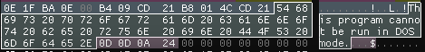

##### PE Signature
  - Offset is specified by `e_lfanew` header.
    - For example if `e_lfanew` is 0x000080 the signature is at 0x80
  - The signature is always `\x50\x45\x00\x00` in ASCII: `PE\0\0`

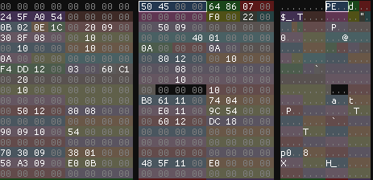

##### COFF File Header
  - Offset is typically directly after the PE signature
  - Contains general metadata about the file

| Offset | Size (Bytes) | Field Name            | Description                                                                                     |
|--------|--------------|------------------------|-------------------------------------------------------------------------------------------------|
| 0x00   | 2            | **Machine**            | Indicates the architecture for which the file is intended.                                      |
| 0x02   | 2            | **NumberOfSections**   | The number of sections in the PE file, such as `.text`, `.data`, etc.                           |
| 0x04   | 4            | **TimeDateStamp**      | The timestamp indicating when the file was created or last modified, in UNIX epoch format.      |
| 0x08   | 4            | **PointerToSymbolTable** | The file offset to the symbol table, used mainly in object files (usually 0 in executables).    |
| 0x0C   | 4            | **NumberOfSymbols**    | The number of entries in the symbol table, used in debugging or object files.                   |
| 0x10   | 2            | **SizeOfOptionalHeader** | The size of the Optional Header that follows this COFF header.                                  |
| 0x12   | 2            | **Characteristics**    | Flags that indicate the attributes and characteristics of the file (e.g., executable, DLL).     |

1. Machine
- **Offset**: `0x00`
- **Description**: Indicates the target architecture of the executable.
- **Possible Values**:
  - `0x014C` – Intel 386 (x86).
  - `0x0200` – Intel Itanium.
  - `0x8664` – x64 (AMD64).
  - `0x01C0` – ARM.
  - `0x01C4` – ARMv7.
  - `0xAA64` – ARM64.
  - `0x0100` – MIPS R3000.

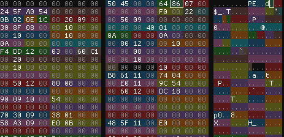

2. Number of Sections
- **Offset**: `0x02`
- **Description**: The number of section headers in the PE file. This field tells the Windows loader how many sections to expect following the Optional Header.

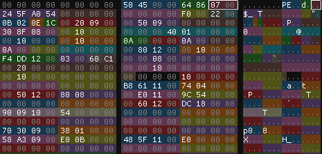

3. Timestamp
- **Offset**: `0x04`
- **Description**: Contains the timestamp for when the file was created or last modified, expressed in UNIX epoch format (seconds since January 1, 1970).
- **Usage**: This can be used to analyze when a PE file was compiled or built.

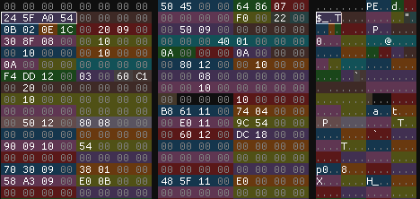

4. PointerToSymbolTable
- **Offset**: `0x08`
- **Description**: Points to the start of the symbol table in the file, used mainly in object files (not in executables).
  - In executables and DLLs, this field is typically set to `0x00000000`.


5. Number of Symbols
- **Offset**: `0x0C`
- **Description**: The number of entries in the symbol table. This is used in object files for debugging purposes, but in executables, it’s generally set to `0x00000000`.

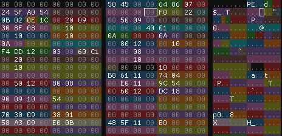

6. SizeOfOptionalHeader
- **Offset**: `0x10`
- **Description**: Specifies the size of the Optional Header that follows the COFF header.
  - For PE32 (32-bit) files, the size is usually `0x00E0` (224 bytes).
  - For PE32+ (64-bit) files, the size is typically `0x00F0` (240 bytes).

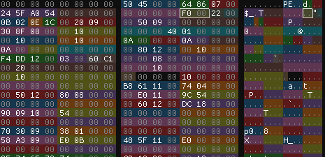

7. Characteristics
- **Offset**: `0x12`
- **Description**: Contains flags that describe the attributes of the PE file, like whether it's executable, relocatable, a DLL, etc.
- **Possible Values (Bit Flags)**:
  - `0x0002` – Executable image.
  - `0x0020` – Application can handle addresses larger than 2GB (large address aware).
  - `0x0100` – The file is a DLL.
  - `0x2000` – The file is a system file.
  - `0x4000` – File is a dynamically loadable driver.
  - `0x8000` – File is removable media-aware.

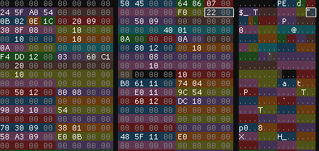

#### OptionalHeader

- Despite it's name it is required for executable images and DLL files. It contains a bunch of information that is needed to properly load the PE file and execute the file in memory.
  - PE32 size: 224 bytes
  - PE64 size: 240 bytes

| Offset (PE32) | Offset (PE32+) | Size | Field Name                   | Description                                                                                      |
|---------------|---------------|------|-------------------------------|--------------------------------------------------------------------------------------------------|
| 0x00          | 0x00          | 2    | **Magic**                     | Specifies whether the file is PE32 (`0x10B`) or PE32+ (`0x20B`).                                 |
| 0x02          | 0x02          | 1    | **Major Linker Version**      | Major version of the linker used to create the file.                                            |
| 0x03          | 0x03          | 1    | **Minor Linker Version**      | Minor version of the linker used to create the file.                                            |
| 0x04          | 0x04          | 4    | **SizeOfCode**                | Total size of all code sections (.text) when loaded in memory.                                  |
| 0x08          | 0x08          | 4    | **SizeOfInitializedData**     | Total size of all initialized data sections (.data) when loaded in memory.                      |
| 0x0C          | 0x0C          | 4    | **SizeOfUninitializedData**   | Total size of all uninitialized data sections (.bss) when loaded in memory.                     |
| 0x10          | 0x10          | 4    | **AddressOfEntryPoint**       | RVA of the entry point function (e.g., `main` or `DllMain`).                                    |
| 0x14          | 0x14          | 4    | **BaseOfCode**                | RVA of the start of the code section.                                                           |
| 0x18          | N/A           | 4    | **BaseOfData**                | (PE32 only) RVA of the start of the data section.                                               |
| 0x1C          | 0x18          | 4/8  | **ImageBase**                 | Preferred address of the image when loaded in memory (default: `0x400000` for PE32, `0x140000000` for PE32+). |
| 0x20          | 0x20          | 4    | **SectionAlignment**          | Alignment of sections when loaded in memory (default: `0x1000`).                                |
| 0x24          | 0x24          | 4    | **FileAlignment**             | Alignment of sections in the file on disk (default: `0x200`).                                   |
| 0x28          | 0x28          | 2    | **MajorOperatingSystemVersion** | Major version of the minimum OS required to run the file.                                       |
| 0x2A          | 0x2A          | 2    | **MinorOperatingSystemVersion** | Minor version of the minimum OS required to run the file.                                       |
| 0x2C          | 0x2C          | 2    | **MajorImageVersion**         | Major version number of the image.                                                              |
| 0x2E          | 0x2E          | 2    | **MinorImageVersion**         | Minor version number of the image.                                                              |
| 0x30          | 0x30          | 2    | **MajorSubsystemVersion**     | Major version of the subsystem required to run the file.                                        |
| 0x32          | 0x32          | 2    | **MinorSubsystemVersion**     | Minor version of the subsystem required to run the file.                                        |
| 0x34          | 0x34          | 4    | **Win32VersionValue**         | Reserved, usually set to 0.                                                                     |
| 0x38          | 0x38          | 4    | **SizeOfImage**               | Total size of the image, including all headers and sections, aligned to **SectionAlignment**.   |
| 0x3C          | 0x3C          | 4    | **SizeOfHeaders**             | Combined size of the DOS Header, PE Header, Optional Header, and Section Headers, aligned to **FileAlignment**. |
| 0x40          | 0x40          | 4    | **CheckSum**                  | Checksum of the image. Required for drivers; optional for user-mode executables.                |
| 0x44          | 0x44          | 2    | **Subsystem**                 | Specifies the subsystem required (e.g., Windows GUI, Console, etc.).                            |
| 0x46          | 0x46          | 2    | **DllCharacteristics**        | Flags indicating characteristics of the DLL (e.g., ASLR, DEP, etc.).                            |
| 0x48          | 0x48          | 4/8  | **SizeOfStackReserve**        | Size of the stack to reserve (initial stack size).                                              |
| 0x4C          | 0x50          | 4/8  | **SizeOfStackCommit**         | Size of the stack to commit initially.                                                          |
| 0x50          | 0x58          | 4/8  | **SizeOfHeapReserve**         | Size of the heap to reserve (initial heap size).                                                |
| 0x54          | 0x60          | 4/8  | **SizeOfHeapCommit**          | Size of the heap to commit initially.                                                           |
| 0x58          | 0x68          | 4    | **LoaderFlags**               | Reserved, usually set to 0.                                                                     |
| 0x5C          | 0x6C          | 4    | **NumberOfRvaAndSizes**       | Number of data directories in the Optional Header (usually 16).                                 |

1. Magic
- **Offset**: 0x00 (PE32 and PE32+)
- **Size**: 2 bytes
- **Description**: 
  - Identifies the file format: 
    - **0x10B** for **PE32**.
    - **0x20B** for **PE32+**.
  - Used to differentiate between 32-bit and 64-bit executable formats.

2. **Major Linker Version**
- **Offset**: 0x02
- **Size**: 1 byte
- **Description**: 
  - The major version number of the linker that generated the file.
  - Indicates the compatibility of the file with the linker software.

3. **Minor Linker Version**
- **Offset**: 0x03
- **Size**: 1 byte
- **Description**: 
  - The minor version number of the linker that generated the file.

4. **SizeOfCode**
- **Offset**: 0x04
- **Size**: 4 bytes
- **Description**: 
  - The total size of all sections that contain executable code (e.g., **.text** section).
  - It represents the size when loaded into memory.

5. **SizeOfInitializedData**
- **Offset**: 0x08
- **Size**: 4 bytes
- **Description**: 
  - The total size of all sections containing initialized data (e.g., **.data** section).

6. **SizeOfUninitializedData**
- **Offset**: 0x0C
- **Size**: 4 bytes
- **Description**: 
  - The total size of all sections containing uninitialized data (e.g., **.bss** section).

7. **AddressOfEntryPoint**
- **Offset**: 0x10
- **Size**: 4 bytes
- **Description**: 
  - The Relative Virtual Address (RVA) of the entry point function, such as `main()` for executables or `DllMain()` for DLLs.
  - This is where execution starts after the program is loaded.

8. **BaseOfCode**
- **Offset**: 0x14
- **Size**: 4 bytes
- **Description**: 
  - The RVA of the start of the code section (e.g., **.text**).
  - Indicates where the code segment begins in memory.

9. **BaseOfData** (PE32 only)
- **Offset**: 0x18
- **Size**: 4 bytes
- **Description**: 
  - The RVA of the start of the data section (e.g., **.data**).
  - This field is not present in **PE32+**.

10. **ImageBase**
- **Offset**: 0x1C (PE32), 0x18 (PE32+)
- **Size**: 4 bytes (PE32), 8 bytes (PE32+)
- **Description**: 
  - The preferred memory address at which the image should be loaded.
  - Defaults to `0x400000` for **PE32** and `0x140000000` for **PE32+**.

11. **SectionAlignment**
- **Offset**: 0x20
- **Size**: 4 bytes
- **Description**: 
  - The alignment of sections in memory.
  - Typically `0x1000` (4KB), but must be greater than or equal to **FileAlignment**.

12. **FileAlignment**
- **Offset**: 0x24
- **Size**: 4 bytes
- **Description**: 
  - The alignment of sections in the file on disk.
  - Usually set to `0x200` (512 bytes), but can vary based on the file format.

13. **MajorOperatingSystemVersion**
- **Offset**: 0x28
- **Size**: 2 bytes
- **Description**: 
  - The major version of the minimum required operating system.

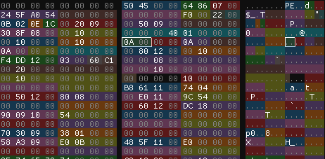

14. **MinorOperatingSystemVersion**
- **Offset**: 0x2A
- **Size**: 2 bytes
- **Description**: 
  - The minor version of the minimum required operating system.

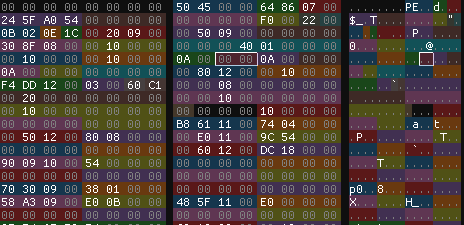

15. **MajorImageVersion**
- **Offset**: 0x2C
- **Size**: 2 bytes
- **Description**: 
  - The major version number of the image, set by the developer.

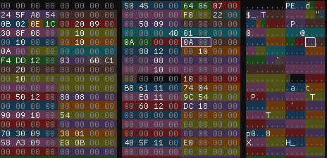

16. **MinorImageVersion**
- **Offset**: 0x2E
- **Size**: 2 bytes
- **Description**: 
  - The minor version number of the image.

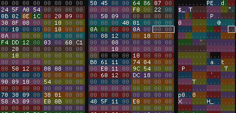

17. **MajorSubsystemVersion**
- **Offset**: 0x30
- **Size**: 2 bytes
- **Description**: 
  - The major version of the subsystem that the image requires (e.g., GUI, console).

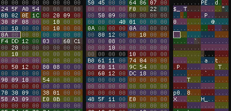

18. **MinorSubsystemVersion**
- **Offset**: 0x32
- **Size**: 2 bytes
- **Description**: 
  - The minor version of the subsystem.


19. **Win32VersionValue**
- **Offset**: 0x34
- **Size**: 4 bytes
- **Description**: 
  - Reserved, usually set to 0.

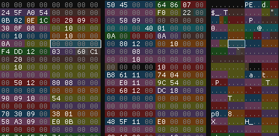

20. **SizeOfImage**
- **Offset**: 0x38
- **Size**: 4 bytes
- **Description**: 
  - The total size of the image, aligned to **SectionAlignment**.
  - This includes headers and all sections.

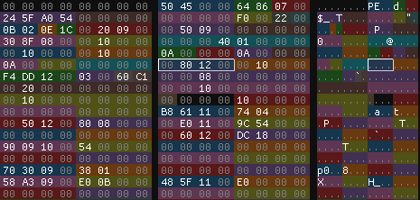

21. **SizeOfHeaders**
- **Offset**: 0x3C
- **Size**: 4 bytes
- **Description**: 
  - The size of all headers combined (DOS Header, PE Header, Optional Header, and Section Headers).
  - Aligned to **FileAlignment**.

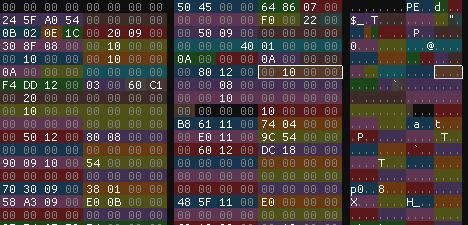

22. **CheckSum**
- **Offset**: 0x40
- **Size**: 4 bytes
- **Description**: 
  - The checksum of the image.
  - Required for kernel-mode drivers; optional for user-mode executables.

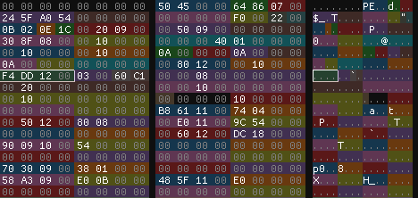

23. **Subsystem**
- **Offset**: 0x44
- **Size**: 2 bytes
- **Description**: 
  - Specifies the subsystem required to run the image.
  - Common values: 
    - **0x02**: Windows GUI.
    - **0x03**: Windows Console.

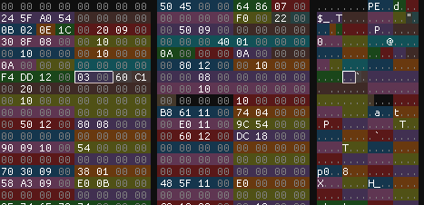

24. **DllCharacteristics**
- **Offset**: 0x46
- **Size**: 2 bytes
- **Description**: 
  - Flags indicating specific characteristics of the DLL, such as:
    - **ASLR** (Address Space Layout Randomization).
    - **DEP** (Data Execution Prevention).

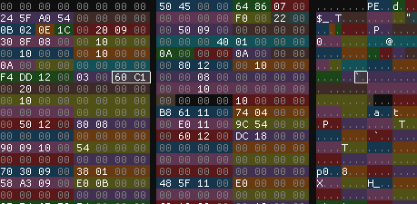

25. **SizeOfStackReserve**
- **Offset**: 0x48 (PE32), 0x48 (PE32+)
- **Size**: 4 bytes (PE32), 8 bytes (PE32+)
- **Description**: 
  - The size of memory reserved for the stack.
  - Defaults to 1 MB for **PE32** and 4 MB for **PE32+**.

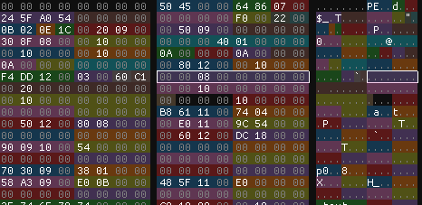

26. **SizeOfStackCommit**
- **Offset**: 0x4C (PE32), 0x50 (PE32+)
- **Size**: 4 bytes (PE32), 8 bytes (PE32+)
- **Description**: 
  - The size of memory initially committed for the stack.

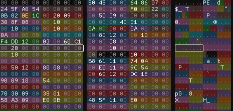

27. **SizeOfHeapReserve**
- **Offset**: 0x50 (PE32), 0x58 (PE32+)
- **Size**: 4 bytes (PE32), 8 bytes (PE32+)
- **Description**: 
  - The size of memory reserved for the heap.

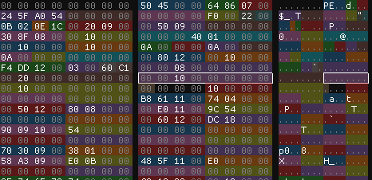

28. **SizeOfHeapCommit**
- **Offset**: 0x54 (PE32), 0x60 (PE32+)
- **Size**: 4 bytes (PE32), 8 bytes (PE32+)
- **Description**: 
  - The size of memory initially committed for the heap.

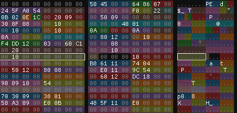

29. **LoaderFlags**
- **Offset**: 0x58 (PE32), 0x68 (PE32+)
- **Size**: 4 bytes
- **Description**: 
  - Reserved for system use, usually set to 0.

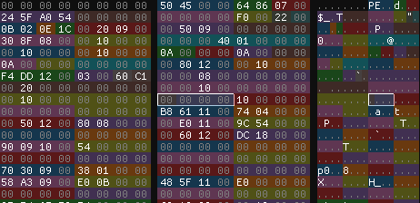

30. **NumberOfRvaAndSizes**
- **Offset**: 0x5C (PE32), 0x6C (PE32+)
- **Size**: 4 bytes
- **Description**: 
  - The number of data directories following this field.
  - Typically set to **16**, covering standard PE data directories like Import Table, Export Table, etc.

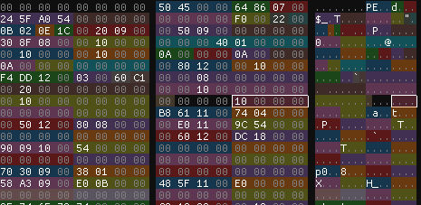